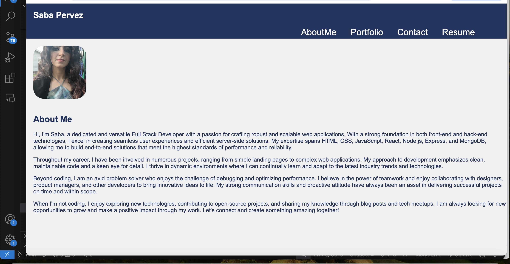

# My-React-Portfolio

## Table of Contents

- [Description](#description)
- [Challenge Elements](#challenge-elements)
- [Installation Guide](#installation-guide)
- [Usage](#usage)
- [Contributing](#contributing)
- [License](#license)

## Description

A portfolio, using my React skills to help set apart from other developers whose portfolios don’t use the latest technologies.

## Challenge Elements

# User Story

AS AN employer looking for candidates with experience building single-page applications
I WANT to view a potential employee's deployed React portfolio of work samples
SO THAT I can assess whether they're a good candidate for an open position

# Acceptance Criteria

GIVEN a single-page application portfolio for a web developer
WHEN I load the portfolio
THEN I am presented with a page containing a header, a section for content, and a footer
WHEN I view the header
THEN I am presented with the developer's name and navigation with titles corresponding to different sections of the portfolio
WHEN I view the navigation titles
THEN I am presented with the titles About Me, Portfolio, Contact, and Resume, and the title corresponding to the current section is highlighted
WHEN I click on a navigation title
THEN I am presented with the corresponding section below the navigation without the page reloading and that title is highlighted
WHEN I load the portfolio the first time
THEN the About Me title and section are selected by default
WHEN I am presented with the About Me section
THEN I see a recent photo or avatar of the developer and a short bio about them
WHEN I am presented with the Portfolio section
THEN I see titled images of six of the developer’s applications with links to both the deployed applications and the corresponding GitHub repository
WHEN I am presented with the Contact section
THEN I see a contact form with fields for a name, an email address, and a message
WHEN I move my cursor out of one of the form fields without entering text
THEN I receive a notification that this field is required
WHEN I enter text into the email address field
THEN I receive a notification if I have entered an invalid email address
WHEN I am presented with the Resume section
THEN I see a link to a downloadable resume and a list of the developer’s proficiencies
WHEN I view the footer
THEN I am presented with text or icon links to the developer’s GitHub and LinkedIn profiles, and their profile on a third platform (Stack Overflow, Twitter)

## Installation Guide

- Use `npm install` in your terminal to download dependencies.
- Use `npm run dev` to start the server.

## Usage

- Application must use React to render content.
- Application has a single Header component that appears on multiple pages, with a Navigation component within it that uses `react-router-dom` to render About Me, Portfolio, Contact, and Resume sections.
- Application has a single Project component that’s used multiple times in the Portfolio section.
- Application has a single Footer component that appears on multiple pages.
- Application must be deployed to Netlify.

## Contributing

We'd love for you to contribute! In order to do so, fork this repository. Your pull request will need approval in order to merge to main.

## License

Copyright (c) Saba Pervez. All rights reserved.

Licensed under the MIT license.

# 

Netlify deployed link : https://669b28b89171a6f7e637a735--neon-rabanadas-44c85b.netlify.app